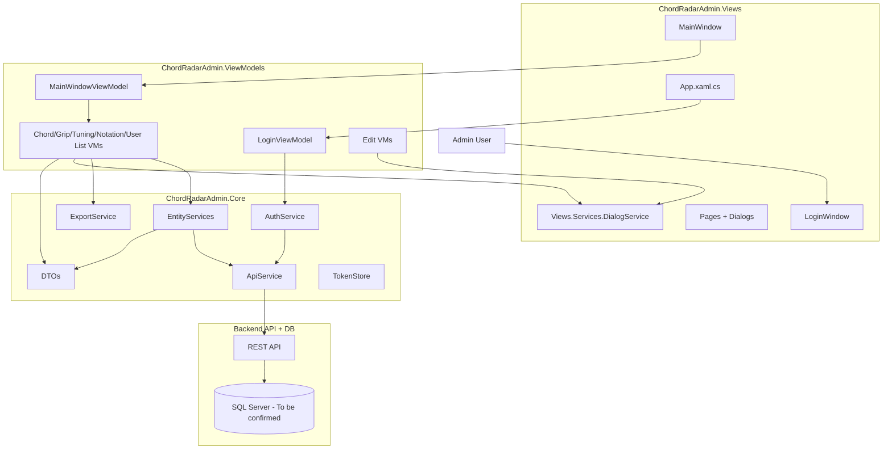

# Architecture

## High-Level Diagram

## Composition Root and Object Lifetimes
- Composition root: `ChordRadarAdmin.Views/App.xaml.cs`
- Core service registration: `ChordRadarAdmin.Core/Infrastructure/ServiceExtensions.cs`
- Main runtime lifetimes:
  - `Singleton`: API/auth/entity/export and shared infrastructure services
  - `Transient`: ViewModels and main windows

## UI Composition
- DataTemplates in `ChordRadarAdmin.Views/App.xaml` map list ViewModels to page views.
- `MainWindowViewModel` controls active page and triggers refresh when navigating.

## Data and Control Flow
1. Login credentials captured by `LoginWindow` and `LoginViewModel`.
2. `AuthService` calls `/auth/login/gui`.
3. Token stored in `TokenStore` and attached by `ApiService` to future requests.
4. Entity list ViewModels call entity services for CRUD.
5. Dialog service bridges UI dialogs to edit DTOs.

## Error Handling
- HTTP errors are mapped in `ApiService.MapHttpError` to typed exceptions.
- Top-level unhandled dispatcher exceptions display a message box in `App.xaml.cs`.

## Architectural Constraints
- Desktop client has no direct DB access.
- Backend API contract is the system boundary.
- Role enforcement is effectively backend-driven rather than client-hidden routes.
