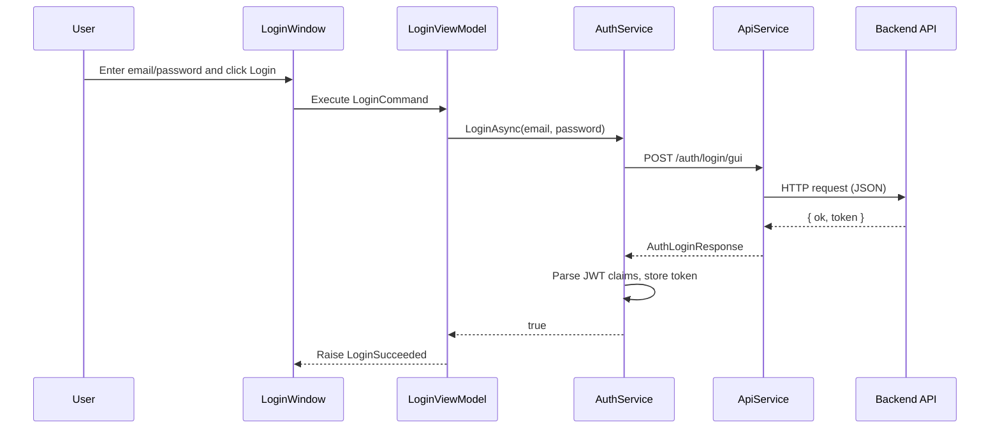
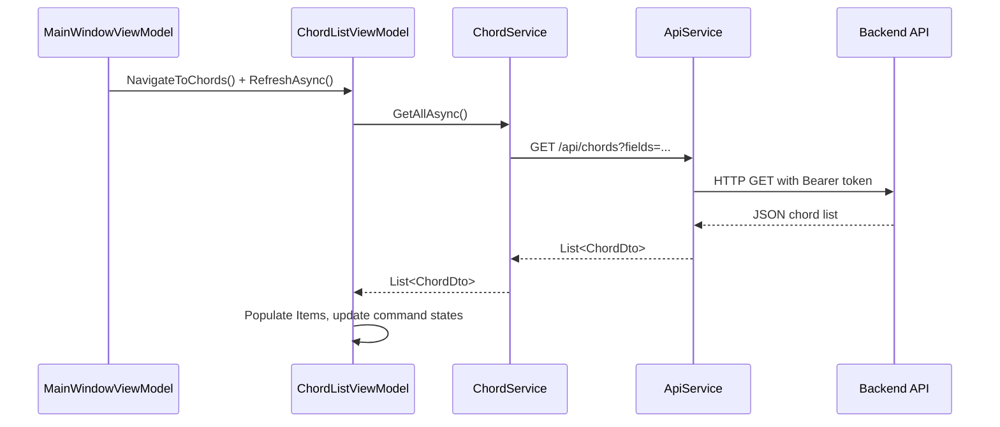
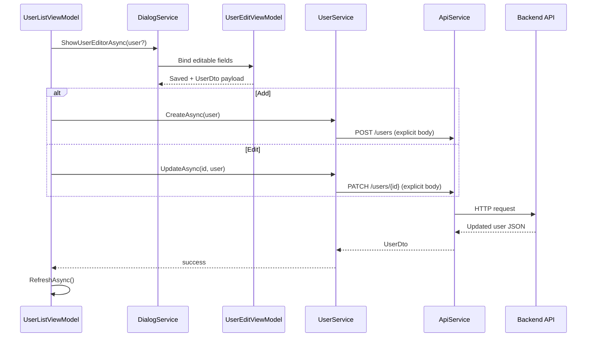

# Request Lifecycle

## Critical Flow 1: Login

Code pointers:
- `ChordRadarAdmin.ViewModels/Auth/LoginViewModel.cs`
- `ChordRadarAdmin.Core/Services/AuthService.cs`
- `ChordRadarAdmin.Core/Services/ApiService.cs`

## Critical Flow 2: Entity List Load (Example: Chords)

Code pointers:
- `ChordRadarAdmin.ViewModels/Main/MainWindowViewModel.cs`
- `ChordRadarAdmin.ViewModels/Chords/ChordListViewModel.cs`
- `ChordRadarAdmin.Core/Services/EntityServices.cs`

## Critical Flow 3: User Add/Edit

Code pointers:
- `ChordRadarAdmin.ViewModels/Users/UserViewModels.cs`
- `ChordRadarAdmin.Views/Dialogs/UserEditDialogWindow.xaml`
- `ChordRadarAdmin.Core/Services/EntityServices.cs`

## Error Path Notes
- HTTP failures propagate as `ApiException`/mapped exceptions from `ApiService`.
- ViewModels catch and surface messages via `ErrorMessage` for bound UI display.

## State Management Notes
- Token state: in-memory via `ITokenStore`.
- Page state: `INavigationService` + `MainWindowViewModel.CurrentPage`.
- Command state: explicit `RaiseCanExecuteChanged` patterns in list ViewModels.
