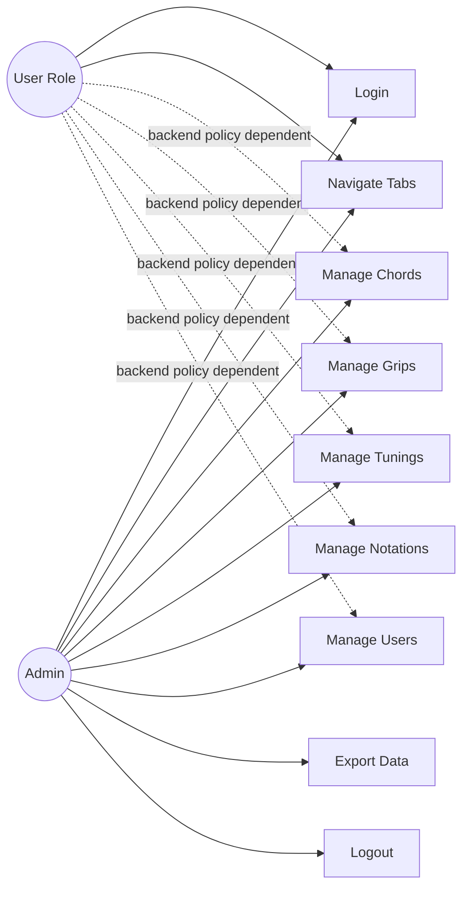

# Use Cases and Roles

## Roles (Actors)
This client defines role data in user/auth models but does not implement strict UI RBAC gating. Authorization is primarily backend-enforced.

Roles observed:
- `admin`
- `user`

Source pointers:
- JWT role parsing in `ChordRadarAdmin.Core/Services/AuthService.cs`
- User role field in `ChordRadarAdmin.Core/Models/EntityDtos.cs`
- Role selection in user edit dialog `ChordRadarAdmin.Views/Dialogs/UserEditDialogWindow.xaml`

## Responsibilities by Role
### Admin
- Sign in to admin client
- View/manage chords, grips, tunings, notations, users
- Export entity datasets
- Manage user account properties

### User (non-admin role value)
- Role exists in model, but practical admin-client access depends on backend token permissions.

## Use Case List
1. Authenticate using email/password.
2. Navigate between entity tabs in main window.
3. Search/filter list rows for each entity.
4. Add a new entity row via modal editor.
5. Edit selected entity row.
6. Delete selected entity row.
7. Export current list to CSV/JSON.
8. Toggle theme and logout.

## Mermaid Use-Case Diagram

## Authentication / Authorization Summary
### Authentication
- Login ViewModel sends credentials to auth service:
  - `ChordRadarAdmin.ViewModels/Auth/LoginViewModel.cs`
- Auth service calls endpoint:
  - `POST /auth/login/gui` in `ChordRadarAdmin.Core/Services/AuthService.cs`
- JWT token is parsed and role extracted in `AuthService.ParseTokenToUser`.

### Authorization Enforcement
- Client sends bearer token in `ChordRadarAdmin.Core/Services/ApiService.cs`.
- No explicit route/menu hiding by role in main shell ViewModel (`ChordRadarAdmin.ViewModels/Main/MainWindowViewModel.cs`).
- Effective permissions are expected to be enforced by backend API responses (401/403 handling in `ApiService`).
